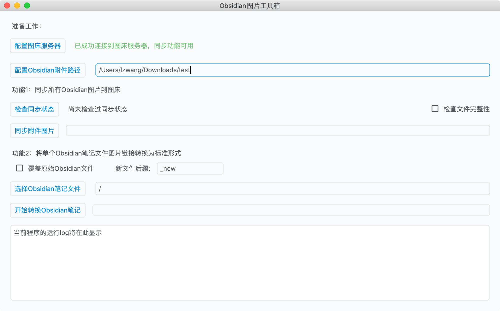
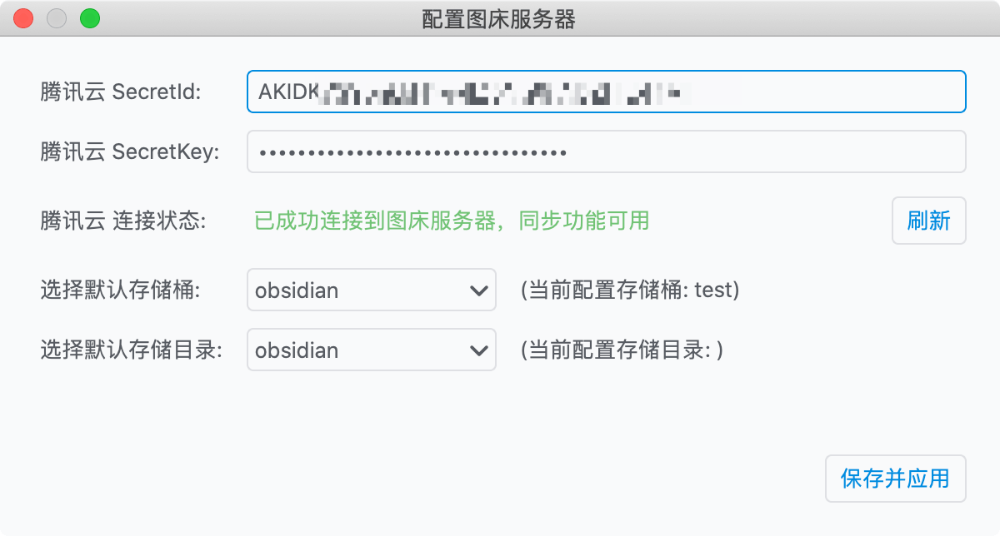

## 关于

利用对象存储接口实现的一个Obsidian图床软件。

## 特点

1. 使用100%的Python实现，支持macOS平台
2. 支持将Obsidian笔记中的本地图片链接转变为通用Markdown链接，转化Obsidian的笔记为通用Markdown文件
3. 支持将Obsidian的附件图片全部同步到图床服务器上

注意：

- 当前图床仅支持腾讯云COS（开通腾讯云COS存储服务参考[腾讯云COS](https://console.cloud.tencent.com/cos5)）

## 截图

### 主页面



### 图床服务器设置界面




## 快速开始

### 项目依赖

注意: `PySide6`使用缓存可能出现问题，所以此处加参数`--no-cache-dir`
```shell
pip install -r requirements.txt --no-cache-dir
```

### 开始开发

运行或调试根目录下的`main.py`即可。


### 是用Pyinstaller打包App为macOS`.app`软件包

在项目根目录，首先删除之前的构建残存目录：
```shell
rm -rf ./build ./dist 
```

然后重新生成打包的文件:
```shell
pyinstaller -D -w main.py
```

然后，在软件根目录的dist目录中：

- `./dist/main.app`: macOS专用软件包（无控制台），双击即可运行
- `./dist/main/main`: 可执行的二进制文件（有控制台）

### 使用Nuitka打包App为二进制文件

在项目根目录，首先删除之前的构建残存目录：
```shell
rm -rf main.build main.dist 
```

然后重新生成打包的文件:
```shell
python -m nuitka --follow-imports --enable-plugin=pyside6 --standalone main.py
```

尝试直接运行App二进制文件:
```shell
./main.dist/main
```

如果启动时有如下报错:
```shell
Traceback (most recent call last):
  File "/Users/lzwang/MyProjects/Python/obsidian-img-uploader/./main.dist/main.py", line 3, in <module>
ImportError: dlopen(/Users/lzwang/MyProjects/Python/obsidian-img-uploader/./main.dist/PySide6/QtWidgets.so, 2): Library not loaded: @rpath/QtQml.framework/Versions/A/QtQml
  Referenced from: /Users/lzwang/MyProjects/Python/obsidian-img-uploader/main.dist/libpyside6.abi3.6.2.dylib
  Reason: image not found
```

需要将Python环境中`PySide6`下的整个`Qt`目录拷贝至项目的`./main.dist/PySide6/`目录下即可(此处使用的是conda创建的`obsidian-img-uploader`环境):

```shell
cp -rf /Users/lzwang/.conda/envs/obsidian-img-uploader/lib/python3.9/site-packages/PySide6/Qt ~/MyProjects/Python/obsidian-img-uploader/main.dist/PySide6/
```

再次尝试运行App二进制文件即可:
```shell
./main.dist/main
```

## 参考资料

1. [Use Nuitka to compile a macOS executable from a Python Pyside6 app](https://www.loekvandenouweland.com/content/pyside6-nuitka-python.html)
